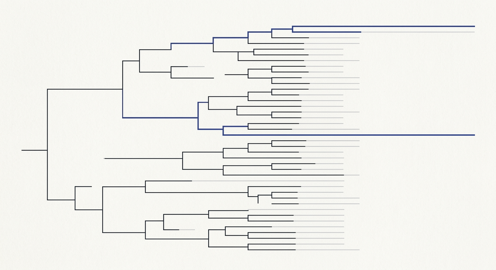

# token-trie

<p align="center">
  
</p>

**A 350M model plays Tetris in your browser and cannot emit invalid syntax.**

Grammar enforcement in the decoder, not in the prompt. Every legal instruction is
pre-tokenized into a trie of token IDs, and at each decoding step the sampler's
valid-next set is intersected with the trie. Malformed output is not discouraged —
it has no path.

Downstream that pays off immediately: `dispatch.js` parses with a plain regex. No
JSON repair, no schema retry, no validation layer.

## Run it

No API key, no build step, no account. First load pulls ~230 MB of model weights;
after that it is instant.

```bash
cd mobile/public && python3 -m http.server 8000
# open http://localhost:8000/demos/
```

## What is honest about this

The Program layer does the planning. In Tetris a hand-written Dellacherie scorer
enumerates all forty placements and ranks them; the model picks from the ranked list.
It is the decoder and the selector, not the planner — see `CLAUDE.md` §4.2.

That is a real result about what a 350M model can be trusted with. It is not "a small
model runs an OS", and every skill needs a planner written behind it.

The current grammar is also a hand-written list of complete instruction strings, which
is why there are exactly five Tetris moves. Compiling it from the argument schemas
instead is the next piece of work.

→ **[PLAN.md](PLAN.md)** — what is built, what is not, and in what order.

## Layout

```
mobile/public/demos/_kernel/   the kernel — 385 lines, five files, no dependencies
mobile/public/demos/{tetris,scavenger}/   the two demos
mobile/public/demos/_cart/     cartridge manifests
strategies/                    markdown strategy cartridges (prompt-time only)
mobile/src/                    a Svelte launcher — four files
```

Renamed from `skillos_mini` on 2026-07-24; "mini" undersold a constrained-decoding
runtime.

---

# skillos_mini

A games-first browser playground for the LLM-OS kernel. A 350M-parameter LLM plays Tetris and solves grid-world quests by emitting grammar-constrained ISA opcodes. **Strategy markdown cartridges** customize how the LLM plays.

Companion to [`llm_os`](https://github.com/EvolvingAgentsLabs/llm_os) — same kernel, richer UX, ships in a browser tab.

## Quick start

```bash
cd mobile
npm install
npm run dev
```

Open <http://localhost:5173>. The launcher lists the games and available strategies. Click a strategy card and the page navigates to the demo with that strategy injected into the system prompt. Browser back returns to the launcher.

## What this is

```
skillos_mini Svelte launcher (one component, GamesLauncher.svelte)
        │
        │ list strategies/<game>/*.md, click → /demos/<game>/index.html?strategy=<id>
        ▼
Bundled demo (vendored from llm_os main)
        │  fetches /strategies/<game>/<id>.md, prepends body to SYSTEM_PROMPT
        ▼
llm_os kernel (token-trie + Sampler + dispatch) — vendored at /demos/_kernel/
        │
        ├─→ game/tetris cartridge
        │     Program-layer enumerates 4 rotations × 10 columns of placements,
        │     simulates each, scores Dellacherie-style, surfaces best_actions[].
        │     LLM ratifies best_actions[0] and emits its sequence.
        │
        └─→ game/scavenger cartridge
              Program-layer runs BFS around walls/pits, surfaces next_step.dir.
              LLM ratifies a single direction.
```

The grammar enforces output validity at the sampler level — strategies can only steer *which* valid opcode the LLM picks, never produce invalid ones.

## What this is NOT

Per [`CLAUDE.md`](CLAUDE.md) §3: no trade verticals, no backend, no cloud LLMs, no Capacitor / Android / PWA, no CartridgeRunner / blackboard / validators / schema-driven UI, no agentic Recipe loops, no iframe Skill sandbox, no model-management UI. The trade-app vertical (electricista/plomero/pintor) was archived in the games-first pivot on 2026-05-05; recoverable from git history at commit `709104b` if needed.

## How a play session works

1. Launcher fetches `/strategies/index.json`, lists each strategy as a card under its game.
2. User clicks a card. Browser navigates to `/demos/<game>/index.html?strategy=<id>`.
3. The demo's `btnLoad.onclick`:
   - Reads `?strategy=<id>` from URL.
   - Fetches `/strategies/<game>/<id>.md`.
   - Strips frontmatter, gets the prose body.
   - Sets `EFFECTIVE_SYSTEM_PROMPT = SYSTEM_PROMPT + body`.
   - Loads the LFM 2.5 350M model and the kernel cartridge.
4. The model plays under the strategy's prose guidance.

## Repo layout

```
skillos_mini/
├── CLAUDE.md                          # mission + scope (read first)
├── README.md                          # this file
├── TESTING.md                         # how to run end-to-end
├── strategies/                        # markdown strategy cartridges
│   ├── index.json                     # launcher's catalog
│   ├── tetris/{conservative,aggressive,well-filler}.md
│   └── scavenger/{cautious,direct,explorer}.md
└── mobile/
    ├── package.json                   # vite + svelte + wllama + gray-matter
    ├── vite.config.ts                 # COOP/COEP plugin
    ├── public/
    │   ├── demos/                     # bundled llm_os games
    │   │   ├── index.html             # raw-demos landing
    │   │   ├── tetris/index.html
    │   │   ├── scavenger/index.html
    │   │   ├── _kernel/               # vendored kernel snapshot
    │   │   └── _cart/game/            # game cartridge manifests
    │   └── strategies/                # built artifact (copy-strategies.mjs)
    ├── scripts/
    │   ├── copy-wllama.mjs
    │   └── copy-strategies.mjs        # vendors strategies/ → public/
    └── src/
        ├── App.svelte                 # GamesLauncher root
        ├── main.ts
        └── components/
            └── GamesLauncher.svelte   # the only Svelte component
```

## Authoring a strategy

Drop a new `.md` file under [`strategies/<game>/`](strategies/) with frontmatter:

```markdown
---
target: tetris
id: my-strategy
name: My Strategy
description: One-line summary for the launcher card.
---

# My Strategy

...prose strategy guidance the LLM reads...
```

Add a single-line entry to [`strategies/index.json`](strategies/index.json) and refresh the launcher. No code changes needed. The grammar enforcement layer guarantees output validity regardless of what the strategy says.

## License

Apache 2.0.
